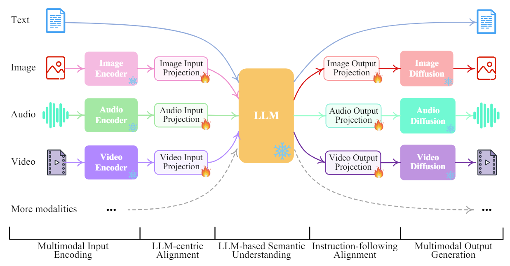
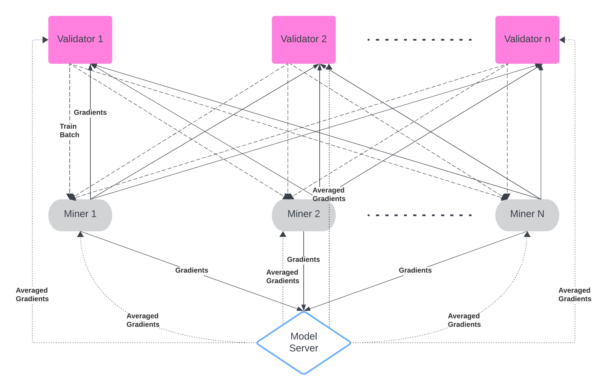

# TRANSVERSE: An any-to-any MultiModal subnet


# Table of Contents
[Introduction](#introduction)

[Key Features](#key-features)

[Roadmap](#roadmap)

[Running miners and validators](#running-miners-and-validators)

[FAQ](#faq)

## Introduction
TransVerse is an any-to-any multimodal model subnet that aims to build the AGI(Artificial General Intelligence) through decentralized distributed ecosystem in Bittensor\
Building AGI is the holy grail of Artificial Intelligence but it contains potential threats against humankind
AGI built on truely decentralized distributed AI platforms like Bittensor is the only solution to guide the AGI serve for mankind.
By leveraging the unlimited power of incentivized distributed compute resource, TransVerse will be able to build a powerful decentralized democratized AGI competing against centralized AIs.

TransVerse model is the combination of LLM, Image Encoder and Decoder, Video Encoder and Decoder, Audio Encoder and Decoder.
Each modality is encoded into their own representations and projected to the main LLM.
Then the LLM converts the encoded representation to target modality representations following text prompts and these representations are decoded to target modality.
TransVerse model training is done by training the projection layers of each modality while freezing the LLM, encoders, and decoders of each modality.
Involving high-performance encoders and decoders benefits not only to enhance the performance of conversion results but also reduces the training scale, making is easier to add extra modality models with minimum effort.




Miners are responsible for receiving training batches and compute gradients on the model.
Validators receive those gradients as responses from miners and validate whether miners are computing gradients correctly or not.
The model server is responsible for aggregating gradients from miners and propagate averaged gradients to the whole system so that miners and validators would be able to update their model



## Key Features
- Cross-modality(Text, Image, Video, Audio to Text, Image, Video, and Audio)

- Parameter efficient distributed training through incentivied Bittensor ecosystem

- Combination of high-performing models in each modality

- Extendable to any modality

## Incentive Mechanism
Currently, miners are rewarded based on how accurately they computed gradients.\
Multi-GPU performance consideration is being involved in the incentive mechanism.
Multi-GPU training is already implemented and miners with bigger computing capacity will be rewarded much more.
This will help reduce the traffic while enhancing the computing capacity of the subnet.

## Roadmap
- Build incentivized distributed training network to train the any-to-any multimodal model
- Train the state-of-the-art multimodal models by leveraging the unlimited compute resources and open-source datasets
- Host state-of-the-art any-to-any multimodal models
- Add more modalities by combining other modality generative models
- Build multimodal agents based on pretrained models

## Running miners and validators
### Preparation

#### Install the subnet
```
pip install -e .
```

#### Load pretrained model checkpoint from HuggingFace
Create a checkpoint dir
```
mkdir ckpt
mkdir ckpt/pretrained_ckpt
mkdir ckpt/pretrained_ckpt/imagebind_ckpt
mkdir ckpt/pretrained_ckpt/imagebind_ckpt/huge
mkdir ckpt/pretrained_ckpt/7b_tiva_v0
mkdir ckpt/pretrained_ckpt/vicuna_ckpt/
mkdir ckpt/pretrained_ckpt/vicuna_ckpt/7b_v0
```

Download the ImageBind checkpoint
```
wget -P ./ckpt/pretrained_ckpt/imagebind_ckpt/huge https://dl.fbaipublicfiles.com/imagebind/imagebind_huge.pth
```


Download checkpoints from huggingface repository
```
huggingface-cli download lmsys/vicuna-7b-v1.5 --local-dir ckpt/pretrained_ckpt/vicuna_ckpt/7b_v0
huggingface-cli download 3it/TransVerse-v1 --local-dir ckpt/pretrained_ckpt/7b_tiva_v0
```

### Data Preparation
Simply run the `scripts/data_prep.sh` or follow the instructions to prepare for dataset

---
#### Image Data preparation
```
mkdir data
mkdir data/T-X_pair_data
cd data/T-X_pair_data
huggingface-cli download 3it/TransVerse-Image-Zip --local-dir ./ --repo-type dataset
unzip cc3m.zip
rm -rf ~/.cache/huggingface/hub/datasets--3it--TransVerse-Image-Zip
rm cc3m.zip
```
#### Video Data preparation
```
huggingface-cli download 3it/TransVerse-Video-Zip --local-dir ./ --repo-type dataset
unzip webvid.zip
rm -rf ~/.cache/huggingface/hub/datasets--3it--TransVerse-Video-Zip
rm webvid.zip
```
#### Audio Data preparation
```
huggingface-cli download 3it/TransVerse-Audio-Zip --local-dir ./ --repo-type dataset
unzip audiocap.zip
rm -rf ~/.cache/huggingface/hub/datasets--3it--TransVerse-Audio-Zip
rm audiocap.zip
```

### Running a miner
```
deepspeed --include localhost:0 --master_addr 127.0.0.1 --master_port 28459 neurons/miner.py --subtensor.network test --wallet.name tw --wallet.hotkey tw-h3 --netuid 74 --axon.port 8091 --logging.debug --logging.trace
```

### Running a validator
```
deepspeed --include localhost:0 --master_addr 127.0.0.1 --master_port 28459 neurons/validator.py --subtensor.network test --wallet.name tw --wallet.hotkey tw-h3 --netuid 74 --axon.port 8091 --logging.debug --logging.trace
```


## FAQ
- Which template should I select on runpod?\
Since running the miner and validator code requires PyTorch==1.3.1+cu117, `MiniGPT4 by Camenduru` works fine for them
